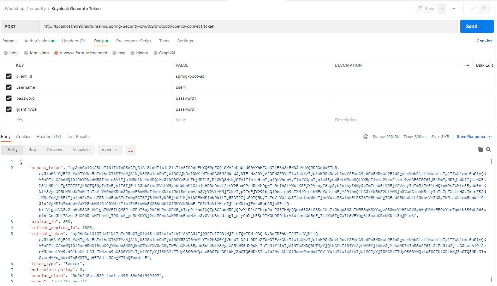
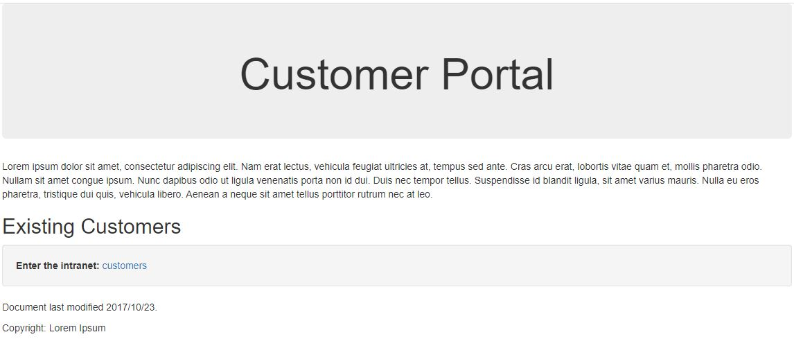
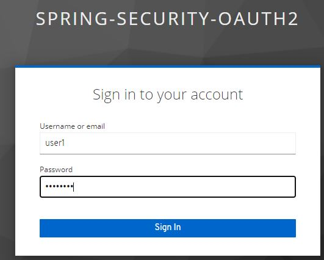
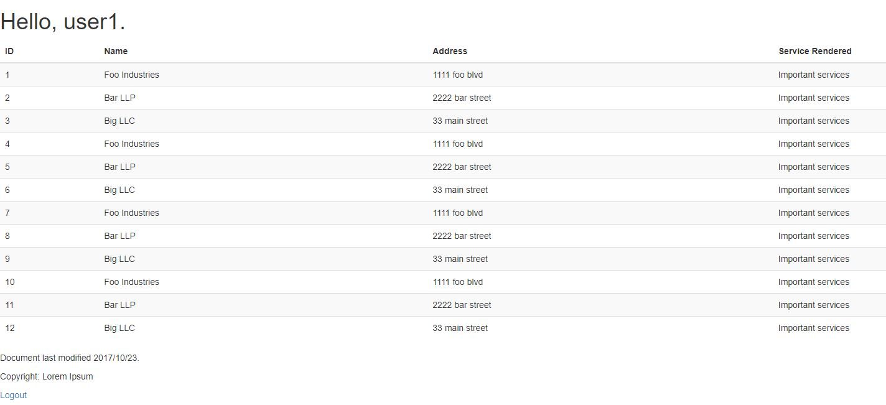
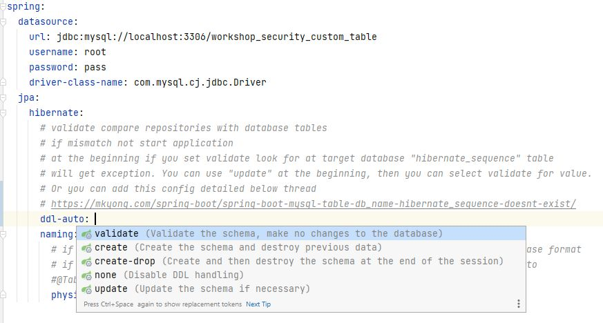

# Spring Security Studies

This application developed for Spring Security capabilities. At the beginning there exist only one endpoint without
security.
<br/>
In time I will add new branches with different capabilities.

# Branch oauth2

With this branch integrated oauth2 with a Third Party Identity and Access Management. Related articles about install IAM
as Docker, Initialize Configuration's of IAM and Integrate Sprint Boot Security

Keycloak : [link](https://www.keycloak.org/getting-started/getting-started-docker)
Initialize and Integrate : [link](https://www.baeldung.com/spring-boot-keycloak)

|File |Description|
|-----|--------|
|[create.sql](docker/create.sql)  | Table changed to a private resource which only authenticate user can select       |
|[data](src/main/java/com/workshop/springsecurity/data)   | Removed old repository, add new repository      |
|[service](src/main/java/com/workshop/springsecurity/service)   | Removed old service, add new service   |
|[application.yml](src/main/resources/application.yml)   | Added new Keycloak configurations under `keycloak`|
|[templates](src/main/resources/templates)   | Added basic html pages|
|[WebSecurityConfig.java](src/main/java/com/workshop/springsecurity/security/WebSecurityConfig.java)  | Updated according to oauh2 and Keycloak|
|[WebController.java](src/main/java/com/workshop/springsecurity/controller/WebController.java)   | Added html's controllers|
|[pom.xml](pom.xml)  | Added new dependencies|

** Some files deleted. You can check these files over history or other branches.

## Keycloak Generate Token



## Public Page



## Keycloak Login Page



## Private Page



# Branch database-customization

With this branch `jdbcAuthentication` customized specific user table. With new table need to implement new table
repository.

Changelog

|File |Description|
|-----|--------|
|[create.sql](docker/create.sql)  | Create Table and Insert Queries changed according to column's names       |
|[data](src/main/java/com/workshop/springsecurity/data)   | Added `data` package for JPA flows      |
|[service](src/main/java/com/workshop/springsecurity/service)   | Added `service` package to access repository      |
|[CustomAuthenticationProvider.java](src/main/java/com/workshop/springsecurity/security/CustomAuthenticationProvider.java)   | Added `CustomAuthenticationProvider` to check over custom table      |
|[application.yml](src/main/resources/application.yml)   | Added new database name and added minor `hibernate` config `physical-strategy`      |

## spring.jpa.hibernate.ddl-auto



## spring.jpa.hibernate.physical-strategy


# Branch jdbc-authentication

With this branch `inMemoryAuthentication` convert to `jdbcAuthentication`.
<br/>
For jdbc authentication you need valid database and tables structure.

## There is valid database

If you have valid database, you can run [create.sql](docker/create.sql) for creating tables and relations.
<br/>
After that you need to update [application.yml](src/main/resources/application.yml) related `datasource` details.

````yaml
    spring:
      datasource:
        url: jdbc:mysql://localhost:3306/workshop_security
        username: root
        password: pass
        driver-class-name: com.mysql.cj.jdbc.Driver
````

## There isn't valid database (Docker Solution)

If you don't have valid database, you can use  [docker-compose.yml](docker/docker-compose.yml)
for creating database, tables and relations in a container.
<br/>
Run the below command in the `docker` directory.

````shell
    docker-compose -f "docker-compose.yml" up -d --build
````

If you use this solution, you don't need to update [application.yml](src/main/resources/application.yml)

# Branch security-first-init

With this branch added features detailed below.

|Feature |Description|
|-----|--------|
|pom.xml | Added Spring Security dependencies to pom.xml       |
|WebSecurityConfig.java  | Added `inMemoryAuthentication` to REST API      |

# Technologies

The project is built on Spring Boot architecture. Maven used as build automation tool.

# Project Setup

- **You need valid database, tables and relations. At branch change notes there is two solutions for database
  requirements.**

- Make sure to be in the root directory
- Run the command to run the project locally:

```
mvnw spring-boot:run
```

- Run the command to run the tets:

```
mvnw test
```

- Run the command to create runnable jar file:

```
mvnw package
```

# API Endpoints

## GET Endpoint `/api/v1/security/get/`

This endpoint return SecurityResponse object. That means successfully access the resource.

## Authentication Detail

|Authentication Type |User Name | Password |
|-----|--------|--------|
|Basic Authentication | user | pass|

### Response

```json
    {
  "id": 7919202912837799685,
  "key": "Resource Key",
  "value": "Resource Value"
}
```

## POST Endpoint `/api/v1/security/post/`

This endpoint return SecurityResponse object. That means successfully access the resource.

## Authentication Detail

|Authentication Type |User Name | Password |
|-----|--------|--------|
|Basic Authentication | user | pass|

### Request

```json
    {
  "key": "Resource Key",
  "value": "Resource Value"
}
```

### Response

```json
    {
  "id": 7919202912837799685,
  "key": "Resource Key",
  "value": "Resource Value"
}
```
